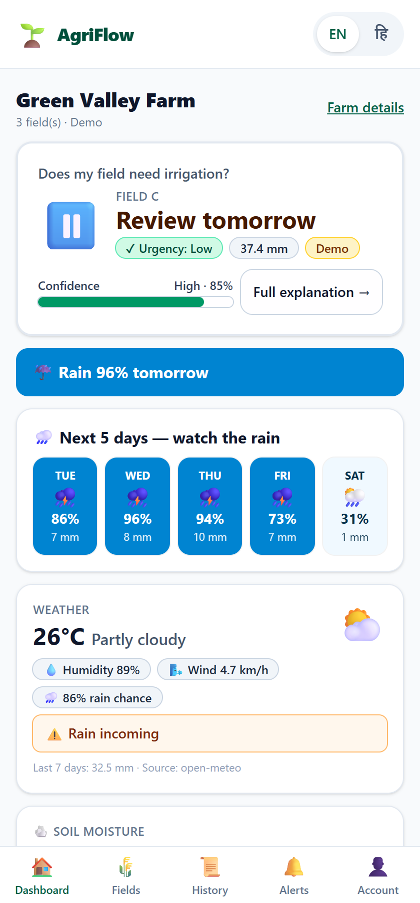
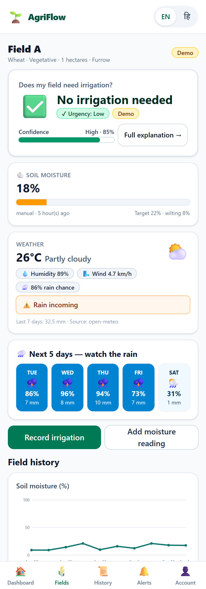

# AgriFlow — Smart Irrigation Intelligence

**Live demo: https://agriflow-web-nu.vercel.app** (API: https://agriflow-api-90yf.onrender.com)
> Free-tier hosts sleep when idle — first request can take ~50s.

Decision-support platform that answers one question for a farmer in seconds:
**"Does my field need irrigation?"** — and explains *why*, with honest labels on
every measurement, forecast, and estimate.

> AgriFlow is a decision-support tool. It is **not** agricultural advice and it
> **never** controls irrigation equipment.




## What's real
- Live weather via **Open-Meteo** (free, keyless) behind a provider abstraction
  (swap or disable with one env var; the UI says "not configured" instead of faking).
- A **transparent rule engine** (TAW/RAW/MAD, ETc = ET0 × Kc, rain deferral,
  method efficiency, confidence rubric) — every recommendation carries reasons,
  warnings and an estimate-not-measurement disclaimer.
- RBAC for **farmer / agronomist / admin**, audit log on every sensitive action,
  device-key sensor ingestion, offline write-queue with idempotent replay,
  PWA + English/Hindi, background worker (DB-backed queue; Redis optional).
- **ML is gated, not shipped**: RandomForest train/evaluate pipeline exists and
  is honest (weak labels, asymmetric farm-safety cost); the rules engine stays
  in production until a model *proves* it beats the baseline (docs/ml.md).

## Quick start

```bash
cp .env.example services/api/.env        # defaults work out of the box
cd services/api
python -m venv .venv && .venv/Scripts/pip install -r requirements.txt   # Windows
.venv/Scripts/uvicorn app.main:app --port 8000                          # seeds demo on first run
python -m app.worker                        # optional background jobs

cd ../../apps/web && npm install
NEXT_PUBLIC_API_BASE=http://localhost:8000 npm run dev                  # http://localhost:3000
```

Or everything: `docker compose up --build` (api :8000, web :3000, Postgres, Redis).

### Demo credentials (seeded synthetic data, labelled demo in the UI)
| Role | Email | Password |
|---|---|---|
| Farmer | farmer@demo.agriflow.dev | DemoFarmer#1 |
| Agronomist | agronomist@demo.agriflow.dev | DemoAgro#12 |
| Admin | admin@demo.agriflow.dev | DemoAdmin#12 |

## Tests & quality gates

```bash
cd services/api
.venv/Scripts/python -m pytest tests          # 38 unit + integration tests
.venv/Scripts/python -m ruff check app tests  # lint
alembic upgrade head                          # migrations roundtrip
python scripts/live_e2e.py --base http://localhost:8000 --demo-login  # 22 live HTTP checks
cd ../../apps/web && npm run build && node e2e_browser.js             # 10 real-browser checks
```

CI (`.github/workflows/ci.yml`) runs lint, type-checks, tests, migration
roundtrip, ML pipeline smoke, and the production web build on every push.

## Architecture (abridged)

```
Farmer PWA (Next.js, offline queue)      Agronomist / Admin (same app, RBAC)
        │ HTTPS (JWT)                                │
        ▼                                            ▼
   FastAPI /api/v1 ──► SQLAlchemy ──► PostgreSQL / SQLite(dev)
        │                                ▲
        ├─ WeatherProvider (Open-Meteo / none / static)
        ├─ IrrigationDecisionEngine (rules, pure functions)
        └─ Worker (DB job queue): weather sync, nightly recs, sensor-offline
   Sensors (ESP32-ready) ── HTTP + X-Device-Key ──► ingestion endpoint
```

Full docs: [architecture](docs/architecture.md) ·
[irrigation engine](docs/irrigation-engine.md) ·
[API contract](docs/api-contract.md) ·
[database](docs/database.md) ·
[ML policy](docs/ml.md) ·
[sensors](docs/sensor-integration.md) ·
[security](docs/security.md) ·
[setup](docs/setup.md) ·
[deployment](docs/deployment.md) ·
[contributing](docs/contributing.md)

## Known limitations (deliberate)
- Confidence scores are a **rubric**, not calibrated probability (labelled so).
- Kc/soil parameters are configurable reference **estimates**, not lab data.
- No pump control, no voice assistant, no push/email without configured SMTP —
  each future path is documented, none is faked.
- Offline sync queue replays writes; server is last-writer-wins with
  idempotency keys, not full CRDT conflict resolution.
- The demo deployment shares one free-tier Postgres instance with other demo
  projects (isolated in its own schema) — it **expires 7 Oct 2026**; data
  survives redeploys but plan a real instance before then. Open-Meteo's free
  personal quota occasionally 429s; the app then serves the last good snapshot
  (stale, with honest timestamp) or degrades confidence — never fabricates.

## License
MIT — see [LICENSE](LICENSE).
